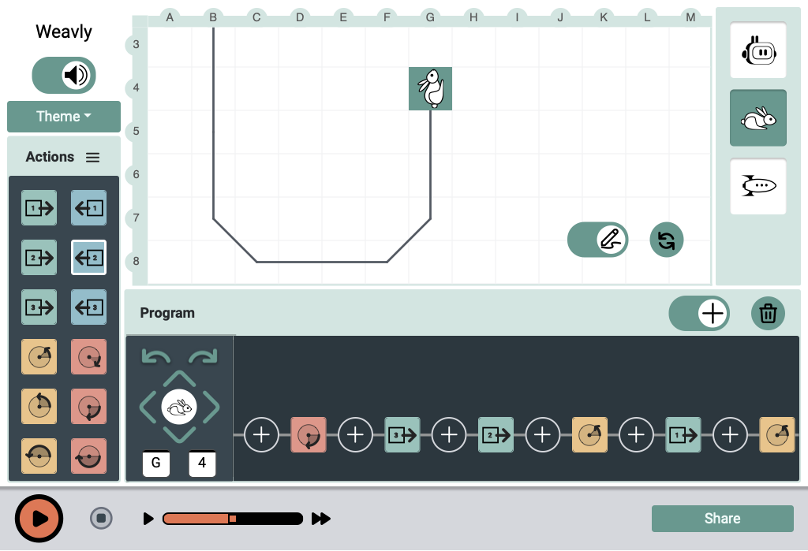

# Weavly

Weavly is a new educational coding tool designed for learners with
disabilities. It can be used with a mouse, touchscreen, or keyboard,
and supports assistive technologies such as screen readers. It is a web
application that works in a browser.



To try the latest version, visit [Weavly online](https://create.weavly.org/).

## Installation for Developers

Running this project requires [npm and Node.js](https://www.npmjs.com/get-npm).
Many of the scripts used in Weavly require npx, which is included with
npm 5.2.0 or higher. Once you download or fork the source code, you will need to
install the required dependencies using the command:

```shell
npm install
```

## Start the application

To start the app in development mode, use the command:

```shell
npm start
```

A URL like [http://localhost:3000](http://localhost:3000) will be displayed in
the console output, open that URL with a browser to see Weavly
in action. The browser window will reload if you add or change files. You will
also see any errors in the console (see [our Contributor's guide for details](./docs/contributing.md)).

## Testing

To run the tests for this project, use the command:

```shell
npm test
```

This launches the test runner in the interactive watch mode. We are using the
[Jest](https://jestjs.io/) and [Enzyme](https://airbnb.io/enzyme/) testing
frameworks. For more details, see [our Contributor's guide](./docs/contributing.md).

## Contributing

Contributions are welcome! For more details about contributing, please see
[our Contributor's guide](./docs/contributing.md).

## License

Weavly is open source software, distributed under the [BSD-3](LICENSE.txt)
license.

## Dependencies

We would like to thank these amazing open source projects and libraries that we
use in Weavly:

| Dependency | License |
| :--------- | :------ |
| [github.com/airbnb/enzyme](https://github.com/airbnb/enzyme) | MIT License |
| [github.com/Bernardo-Castilho/dragdroptouch](https://github.com/Bernardo-Castilho/dragdroptouch) | MIT License |
| [github.com/facebook/react](https://github.com/facebook/react) | MIT License |
| [github.com/googlefonts/roboto](https://github.com/googlefonts/roboto) | Apache License 2.0 |
| [github.com/JedWatson/classnames](https://github.com/JedWatson/classnames) | MIT License |
| [github.com/KyleAMathews/typefaces/tree/master/packages/roboto](https://github.com/KyleAMathews/typefaces/tree/master/packages/roboto) | MIT License |
| [github.com/react-bootstrap/react-bootstrap](https://github.com/react-bootstrap/react-bootstrap) | MIT License |
| [github.com/sass/node-sass](https://github.com/sass/node-sass) | MIT License |
| [github.com/Tonejs/Tone.js](https://github.com/Tonejs/Tone.js) | [MIT License](https://github.com/Tonejs/Tone.js/blob/dev/LICENSE.md)|
| [loading.io](https://loading.io/) | [Loading.io Free License](https://loading.io/license/#free-license) |
| [WAI-ARIA Authoring Practices 1.1](https://www.w3.org/TR/wai-aria-practices-1.1/) | [W3C License](https://www.w3.org/Consortium/Legal/2015/copyright-software-and-document) |
