# Image Credits

The "landmarks" world in Weavly uses a number of third-party images. Most of the
images used on the World Landmarks map are designated as
[CC0 1.0 Universal (CC0 1.0)](https://creativecommons.org/publicdomain/zero/1.0/).
Here is the description for this designation:

> The person who associated a work with this deed has dedicated the work to the
> public domain by waiving all of his or her rights to the work worldwide under
> copyright law, including all related and neighboring rights, to the extent
> allowed by law. You can copy, modify, distribute and perform the work, even
> for commercial purposes, all without asking permission.

We have credited the author when this information was provided.

The remaining images are designated as
[Public Domain Mark 1.0](https://creativecommons.org/publicdomain/mark/1.0/).
Here is the description for this designation:

> This work has been identified as being free of known restrictions under
> copyright law, including all related and neighboring rights. You can copy,
> modify, distribute and perform the work, even for commercial purposes, all
> without asking permission.

The table below provides the license and author information for all images used.
Click on the image thumbnail to view the original.

| Image | Title | Author | License |
| ----- | ----- | ------ | ------- |
| [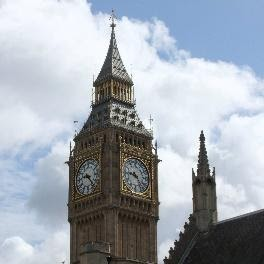](https://flic.kr/p/twaqdP) | Big Ben, London | [Florian Bieser](https://www.flickr.com/photos/florian_bieser/) | [CC0 1.0](https://creativecommons.org/publicdomain/zero/1.0/) |
| [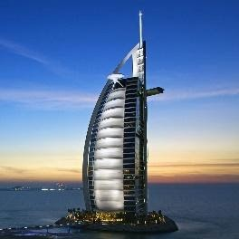](https://flic.kr/p/KK5QWb) | Burj Al Arab | [lettie](https://www.flickr.com/photos/lettie0501/) | [Public Domain Mark 1.0](https://creativecommons.org/publicdomain/mark/1.0/) |
| [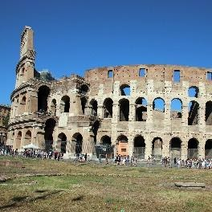](https://flic.kr/p/2gLnRvu) | Colosseum | [Gary Todd](https://www.flickr.com/photos/101561334@N08/) | [Public Domain Mark 1.0](https://creativecommons.org/publicdomain/mark/1.0/) |
| [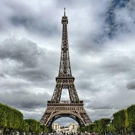](https://flic.kr/p/xgkCyR) | Eiffel Tower | [Mustang Joe](https://www.flickr.com/photos/mustangjoe/) | [CC0 1.0](https://creativecommons.org/publicdomain/zero/1.0/) |
| [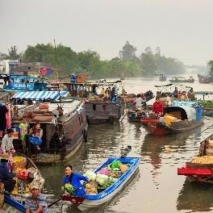](https://flic.kr/p/NQEEsB) | Floating-market, Vietnam | [Water Alternatives Photos](https://www.flickr.com/photos/water_alternatives/) | [CC0 1.0](https://creativecommons.org/publicdomain/zero/1.0/) |
| [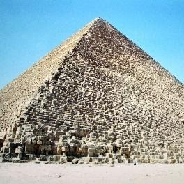](https://flic.kr/p/fVrTDr) | Giza: Great Pyramid of Khufu | [Gary Todd](https://www.flickr.com/photos/101561334@N08/) | [CC0 1.0](https://creativecommons.org/publicdomain/zero/1.0/) |
| [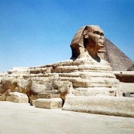](https://flic.kr/p/fVshLj) | Giza: Great Sphinx | [Gary Todd](https://www.flickr.com/photos/101561334@N08/) | [CC0 1.0](https://creativecommons.org/publicdomain/zero/1.0/) |
| [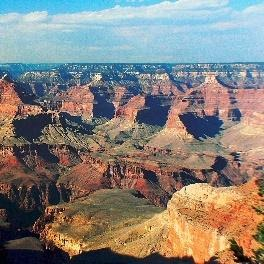](https://flic.kr/p/oGM82v) | The Grand Canyon, Arizona | [Bernard Spragg](https://www.flickr.com/photos/volvob12b/) | [CC0 1.0](https://creativecommons.org/publicdomain/zero/1.0/) |
| [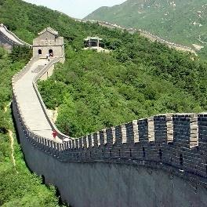](https://flic.kr/p/nQwhH) | Grande Muralha - Great Wall | [Andre Deak](https://www.flickr.com/photos/pontodeak/) | [CC0 1.0](https://creativecommons.org/publicdomain/zero/1.0/) |
| [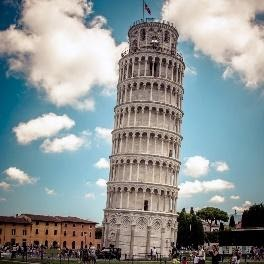](https://www.publicdomainpictures.net/en/view-image.php?image=360599&picture=leaning-tower-of-pisa) | Leaning Tower of Pisa | [Petr Kratochvil](https://www.facebook.com/kratochvil.petr) | [CC0 1.0](https://creativecommons.org/publicdomain/zero/1.0/) |
| [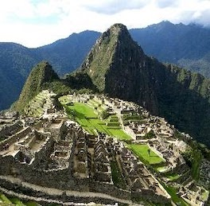](https://flic.kr/p/2bu4GkA) | Machu Picchu | [Wasif Malik](https://www.flickr.com/photos/wasifmalik/) | [CC0 1.0](https://creativecommons.org/publicdomain/zero/1.0/) |
| [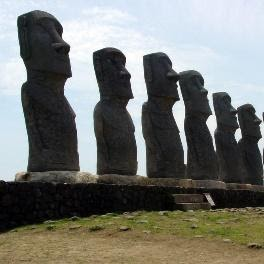](https://flic.kr/p/9iuVoX) | Moai Statues | [Mike B in Colorado](https://www.flickr.com/photos/63042497@N00/) | [CC0 1.0](https://creativecommons.org/publicdomain/zero/1.0/) |
| [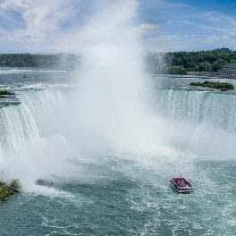](https://flic.kr/p/CtWtdh) | Niagara Falls | [Werner Bayer](https://www.flickr.com/photos/wbayercom/) | [CC0 1.0](https://creativecommons.org/publicdomain/zero/1.0/) |
| [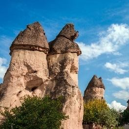](https://flic.kr/p/2aSC6Wq) | Paşabağ | [Feridun F. Alkaya](https://www.flickr.com/photos/feridun_f_alkaya/) | [CC0 1.0](https://creativecommons.org/publicdomain/zero/1.0/) |
| [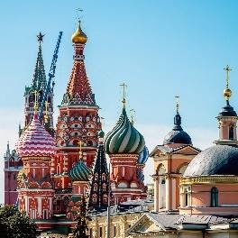](https://flic.kr/p/2jsKukd) | St. Basil’s Cathedral on Red Square in Moscow | [Artem Beliaikin](https://www.flickr.com/photos/artembali/) | [CC0 1.0](https://creativecommons.org/publicdomain/zero/1.0/) |
| [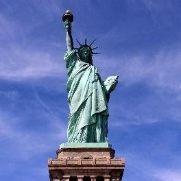](https://flic.kr/p/21RsmfF) | Statue of Liberty | [Claudia Saffar](https://www.flickr.com/photos/153667655@N08/) | [Public Domain Mark 1.0](https://creativecommons.org/publicdomain/mark/1.0/) |
| [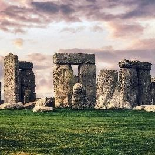](https://flic.kr/p/2kULoDE) | Stonehenge | [Michael Sutton](https://www.flickr.com/photos/192368704@N03/) | [Public Domain Mark 1.0](https://creativecommons.org/publicdomain/mark/1.0/) |
| [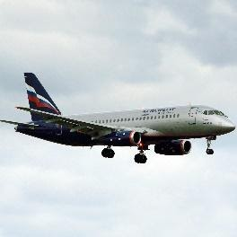](https://flic.kr/p/ULMDzk) | Sukhoi Superjet 100 | [Bartlomiej Mostek](https://www.flickr.com/photos/barteq24/) | [CC0 1.0](https://creativecommons.org/publicdomain/zero/1.0/) |
| [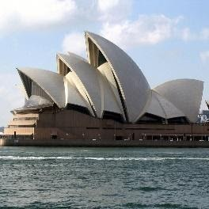](https://flic.kr/p/6oXs7X) | Sydney Opera House | [Chiara Coetzee](https://www.flickr.com/photos/29507259@N02) | [CC0 1.0](https://creativecommons.org/publicdomain/zero/1.0/) |
| [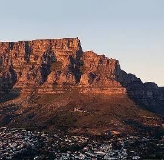](https://commons.wikimedia.org/wiki/File:Cape_Town_Mountain.jpg) | Table Mountain, Cape Town | [Safari Travel Plus](https://www.safaritravelplus.com/) | [CC0 1.0](https://creativecommons.org/publicdomain/zero/1.0/) |
| [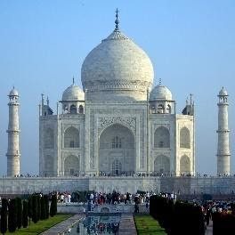](https://flic.kr/p/riG6BU) | The Taj Mahal | [Don't just "click" pictures; Shoot Stories!](https://www.flickr.com/photos/nileshkorgaokar/) | [CC0 1.0](https://creativecommons.org/publicdomain/zero/1.0/) |
| [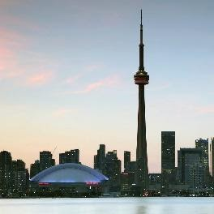](https://flic.kr/p/2miRbuf) | Toronto Skyline | [Mohamed Amine BOUKHOULDA](https://www.flickr.com/photos/ufo79onearth/)  | [CC0 1.0](https://creativecommons.org/publicdomain/zero/1.0/) |
| [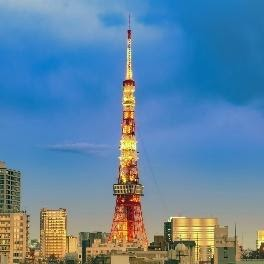](https://flic.kr/p/24iE2PX) | Tower Sunset | [Romain Guy](https://www.flickr.com/photos/romainguy) | [CC0 1.0](https://creativecommons.org/publicdomain/zero/1.0/) |
| [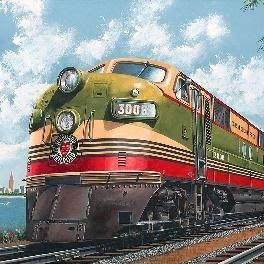](https://flic.kr/p/2ma3X4x) | Train e USA seaboard railroad diesel - New York-Washington-Miami express passenger train | [Jerome Biederman](https://www.flickr.com/photos/ausdew/) | [Public Domain Mark 1.0](https://creativecommons.org/publicdomain/mark/1.0/) |
| [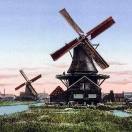](https://www.loc.gov/resource/ppmsc.05874/) | Two windmills, Holland 1895 | *Unknown* | [Public Domain Mark 1.0](https://creativecommons.org/publicdomain/mark/1.0/) |
