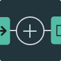
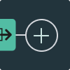
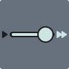

# Key Bindings

A keyboard shortcut provides fast access to a range of Weavly's features using
one or more key presses.  Keyboard shortcuts are disabled by default, and can be
turned on using the keyboard input menu, which is displayed when the keyboard
icon is clicked.  Once key bindings are enabled, the keyboard input menu can
also be opened using the question mark key.

Weavly supports two sets of keyboard shortcuts.  The most basic shortcuts are
activated by holding a key like alt, or holding control and alt at the same
time, and then pressing a particular letter.  Longer shortcuts involve hitting a
combination of keys to start a sequence, and then entering additional letters.

In the instructions below, keys that need to be held at the same time are
indicated using plus signs, and keys that need to be entered separately are
divided using commas. For example, the shortcut `Ctrl + Alt + x, x` is
activated by holding control, alt, and x at the same time, releasing all keys,
and then hitting the x key again by itself.

## Control+Alt (Apple: Control+Option) Key Bindings

NVDA has many commands that make use of the alt key, to avoid
        conflicting with these, the default keyboard input scheme uses the control
        and alt keys in combination with the starting key of a sequence.
        Those key bindings are as follows.

| Action | Keyboard Shortcut | Icon |
| ---- | ------- | ----- |
| Add the selected action block to the program after the focused node or the focused action block | Ctrl + Alt + a |  |
| Add the selected action block to the beginning of the program | Ctrl + Alt + b |  |
| Add the selected action block to the end of the program | Ctrl + Alt + e |  |
| Delete the focused action block from the program | Ctrl + Alt + d | Not available |
| Initiate announcement of the scene | Ctrl + Alt + i | Not available |
| Decrease the program speed | < |  |
| Increase the program speed | > |  |
| Play or pause the program | Ctrl + Alt + p |  |
| Refresh the scene | Ctrl + Alt + r |  |
| Show the keyboard shortcuts menu | ? |  |
| Stop the program from playing | Ctrl + Alt + s |  |
| Change the current visual theme to the dark theme | Ctrl + Alt + x, t, 3 |  |
 | Change the current visual theme to the default theme | Ctrl + Alt + x, t, 1 |  |
 | Change the current visual theme to the grayscale theme | Ctrl + Alt + x, t, 4 |  |
 | Change the current visual theme to the high contrast theme | Ctrl + Alt + x, t, 5 |  |
 | Change the current visual theme to the light theme | Ctrl + Alt + x, t, 2 |  |
 | Delete all the action blocks in the program | Ctrl + Alt + x, d |  |
 | Move focus to the actions panel | Ctrl + Alt + x, f, a | Not available |
 | Move focus to the add node toggle | Ctrl + Alt + x, f, t |  |
 | Move focus to the beginning of the program | Ctrl + Alt + x, f, q | Not available |
 | Move focus to the character position column input field | Ctrl + Alt + x, f, x | Not available |
 | Move focus to the character position controls | Ctrl + Alt + x, f, c | Not available |
 | Move focus to the character position row input field | Ctrl + Alt + x, f, y | Not available |
 | Move focus to the page title | Ctrl + Alt + x, f, h | Not available |
 | Move focus to the pen toggle | Ctrl + Alt + x, f, s | Not available |
 | Move focus to the play button | Ctrl + Alt + x, f, p | Not available |
 | Move focus to the world selector | Ctrl + Alt + x, f, w |  |
 | Move the character down | Ctrl + Alt + x, c, m, d |  |
 | Move the character left | Ctrl + Alt + x, c, m, l |  |
 | Move the character right | Ctrl + Alt + x, c, m, r |  |
 | Move the character up | Ctrl + Alt + x, c, m, u |  |
 | Select the backward 1 square action block | Ctrl + Alt + x, a, b, 1 |  |
 | Select the backward 2 squares action block | Ctrl + Alt + x, a, b, 2 | Not available |
 | Select the backward 3 squares action block | Ctrl + Alt + x, a, b, 3 | Not available |
 | Select the forward 1 square action block | Ctrl + Alt + x, a, f, 1 |  |
 | Select the forward 2 squares action block | Ctrl + Alt + x, a, f, 2 | Not available |
 | Select the forward 3 squares action block | Ctrl + Alt + x, a, f, 3 | Not available |
 | Select the turn left 180 degrees action block | Ctrl + Alt + x, a, l, 3 | Not available |
 | Select the turn left 45 degrees action block | Ctrl + Alt + x, a, l, 1 |  |
 | Select the turn left 90 degrees action block | Ctrl + Alt + x, a, l, 2 |  |
 | Select the turn right 180 degrees action block | Ctrl + Alt + x, a, r, 3 | Not available |
 | Select the turn right 45 degrees action block | Ctrl + Alt + x, a, r, 1 |  |
 | Select the turn right 90 degrees action block | Ctrl + Alt + x, a, r, 2 |  |
 | Turn the audio feedback announcements on or off | Ctrl + Alt + x, x | Not available |
 | Turn the character left 45 degrees | Ctrl + Alt + x, c, t, l |  |
 | Turn the character right 45 degrees | Ctrl + Alt + x, c, t, r |  |

## Alt (Apple: Option) Key Bindings

VoiceOver uses ctrl+alt for many of its commands, to avoid
        conflicting with those, there is a keyboard input scheme which uses the
        alt key in combination with the starting key of a sequence.
        Those key bindings are as follows:

| Action | Keyboard Shortcut | Icon |
| ---- | ------- | ----- |
| Add the selected action block to the program after the focused node or the focused action block | Alt + a |  |
| Add the selected action block to the beginning of the program | Alt + b |  |
| Add the selected action block to the end of the program | Alt + e |  |
| Delete the focused action block from the program | Alt + d | Not available |
| Initiate announcement of the scene | Alt + i | Not available |
| Decrease the program speed | < |  |
| Increase the program speed | > |  |
| Play or pause the program | Alt + p |  |
| Refresh the scene | Alt + r |  |
| Show the keyboard shortcuts menu | ? |  |
| Stop the program from playing | Alt + s |  |
| Change the current visual theme to the dark theme | Alt + x, t, 3 |  |
 | Change the current visual theme to the default theme | Alt + x, t, 1 |  |
 | Change the current visual theme to the grayscale theme | Alt + x, t, 4 |  |
 | Change the current visual theme to the high contrast theme | Alt + x, t, 5 |  |
 | Change the current visual theme to the light theme | Alt + x, t, 2 |  |
 | Delete all the action blocks in the program | Alt + x, d |  |
 | Move focus to the actions panel | Alt + x, f, a | Not available |
 | Move focus to the add node toggle | Alt + x, f, t |  |
 | Move focus to the beginning of the program | Alt + x, f, q | Not available |
 | Move focus to the character position column input field | Alt + x, f, x | Not available |
 | Move focus to the character position controls | Alt + x, f, c | Not available |
 | Move focus to the character position row input field | Alt + x, f, y | Not available |
 | Move focus to the page title | Alt + x, f, h | Not available |
 | Move focus to the pen toggle | Alt + x, f, s | Not available |
 | Move focus to the play button | Alt + x, f, p | Not available |
 | Move focus to the world selector | Alt + x, f, w |  |
 | Move the character down | Alt + x, c, m, d |  |
 | Move the character left | Alt + x, c, m, l |  |
 | Move the character right | Alt + x, c, m, r |  |
 | Move the character up | Alt + x, c, m, u |  |
 | Select the backward 1 square action block | Alt + x, a, b, 1 |  |
 | Select the backward 2 squares action block | Alt + x, a, b, 2 | Not available |
 | Select the backward 3 squares action block | Alt + x, a, b, 3 | Not available |
 | Select the forward 1 square action block | Alt + x, a, f, 1 |  |
 | Select the forward 2 squares action block | Alt + x, a, f, 2 | Not available |
 | Select the forward 3 squares action block | Alt + x, a, f, 3 | Not available |
 | Select the turn left 180 degrees action block | Alt + x, a, l, 3 | Not available |
 | Select the turn left 45 degrees action block | Alt + x, a, l, 1 |  |
 | Select the turn left 90 degrees action block | Alt + x, a, l, 2 |  |
 | Select the turn right 180 degrees action block | Alt + x, a, r, 3 | Not available |
 | Select the turn right 45 degrees action block | Alt + x, a, r, 1 |  |
 | Select the turn right 90 degrees action block | Alt + x, a, r, 2 |  |
 | Turn the audio feedback announcements on or off | Alt + x, x | Not available |
 | Turn the character left 45 degrees | Alt + x, c, t, l |  |
 | Turn the character right 45 degrees | Alt + x, c, t, r |  |
