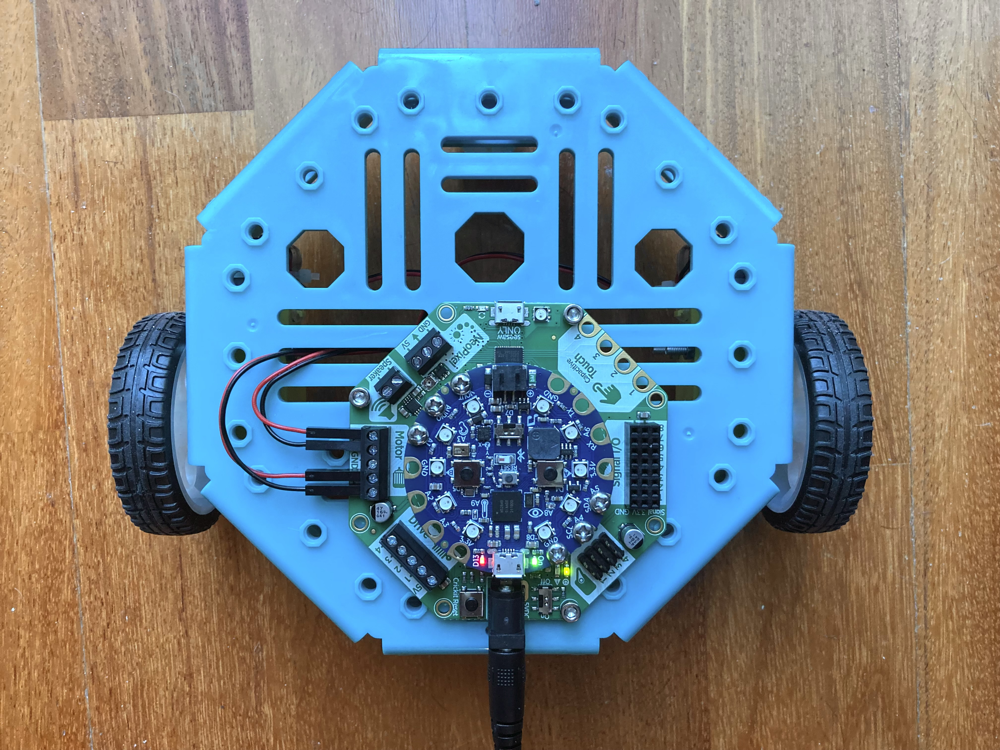
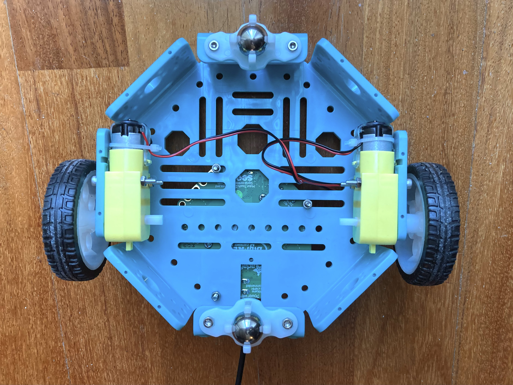

# Adafruit CRICKIT with Circuit Playground Bluefruit and DC motors

## Parts

- Octagon Chassis
  - $9.95 USD at Adafruit <https://www.adafruit.com/product/4466>
- Adafruit CRICKIT for Circuit Playground Express
  - $29.95 USD at Adafruit <https://www.adafruit.com/product/3093>
- Circuit Playground Bluefruit
  - $24.95 USD at Adafruit <https://www.adafruit.com/product/4333>
- 2 x "TT Motor"
  - $2.95 USD each at Adafruit <https://www.adafruit.com/product/3777>
- 2 wheels for "TT Motor"
  - $1.50 USD each at Adafruit <https://www.adafruit.com/product/3763>
- 2 x 20mm Height Metal Caster Bearing Wheel
  - $1.95 USD each at Adafruit <https://www.adafruit.com/product/3948>
- Power source supplying 4V to 5.5VDC
- M3 nuts and bolts
  - 4 x 30mm, for attaching the motors to the chassis
  - 4 x 20mm, for attaching the metal castor bearing wheels to the chassis
  - 3 x 20mm, for attaching the CRICKIT board to the chassis

## Tools

- Phillips-head screwdriver size PH1, for attaching the Circuit Playground
  Bluefruit to the CRICKIT
- Phillips-head screwdriver size PH00, for the DC motor terminals on the CRICKIT
- Tools to tighten the M3 nuts and bolts

## Notes

- Controlling the motors by how long they are run for does not produce
  accurate enough motion
