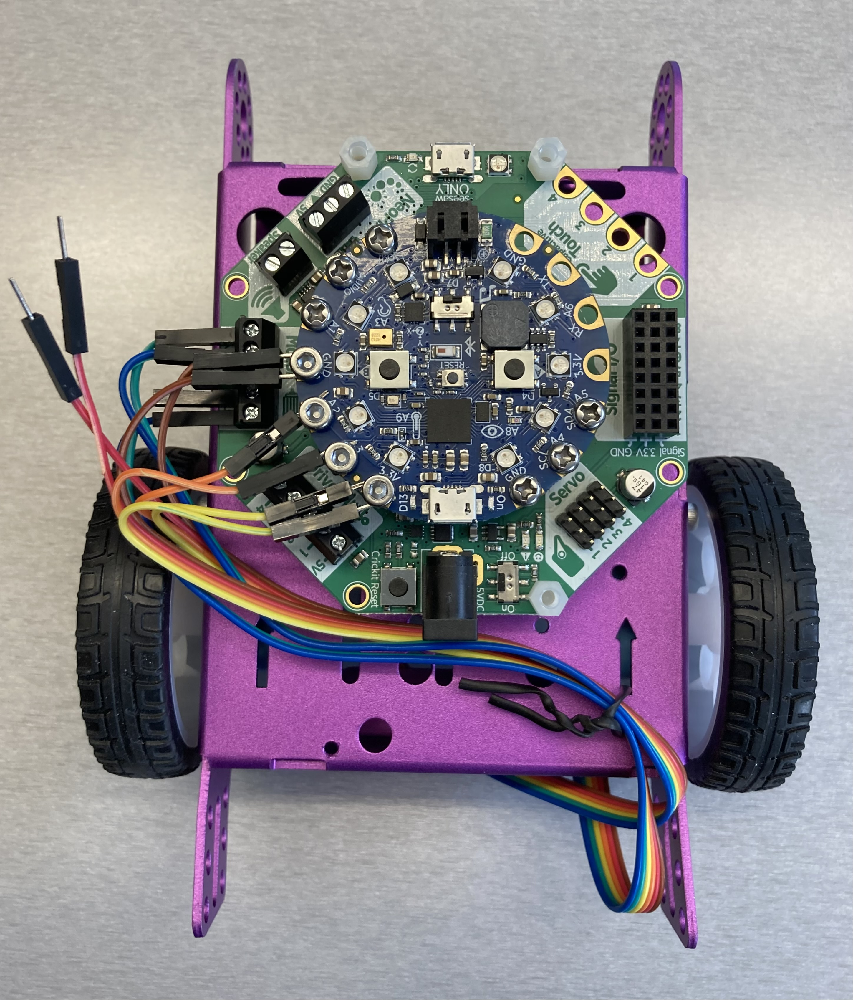

# Adafruit CRICKIT with Circuit Playground Bluefruit and DC motors with encoders connected to Circuit Playground

## Parts

- Purple Aluminum Chassis
  - $14.95 USD at Adafruit <https://www.adafruit.com/product/3796>
- Adafruit CRICKIT for Circuit Playground Express
  - $29.95 USD at Adafruit <https://www.adafruit.com/product/3093>
- Circuit Playground Bluefruit
  - $24.95 USD at Adafruit <https://www.adafruit.com/product/4333>
- 2 x Hobby Motor with Encoder
  - $6.50 USD each at Sparkfun <https://www.sparkfun.com/products/16413>
- 2 wheels for "TT Motor"
  - $1.50 USD each at Adafruit <https://www.adafruit.com/product/3763>
- 20mm Height Metal Caster Bearing Wheel
  - $1.95 USD at Adafruit <https://www.adafruit.com/product/3948>
- Power source supplying 4V to 5.5VDC
- M3 nuts and bolts
  - 4 x 30mm, for attaching the motors to the chassis
  - 2 x 10mm, for attaching the metal castor bearing wheel to the chassis
  - 4 x 10mm, for attaching the encoder pins to the Circuit Playground
- Standoffs for attaching the CRICKIT to the chassis, with some separation
  so that the components on the bottom of the CRICKIT do not touch the metal
  chassis

## Tools

- Phillips-head screwdriver size PH1, for attaching the Circuit Playground
  Bluefruit to the CRICKIT
- Phillips-head screwdriver size PH00, for the DC motor terminals on the CRICKIT
- Tools to tighten the M3 nuts and bolts

## Wiring

Starting from the right when looking at the jumper wire connector when it is
attached to the motor and the motor is oriented with the connector at the
top, with the colours as seen in the photos above.

Left motor:

- Motor pin 1 (blue) and motor pin 2 (green) to the CRICKIT DC motor 1
  terminals
- Encoder +ve (yellow) to Circuit Playground 3.3V
- Encoder A (orange) to Circuit Playground A2
- Encoder -v (brown) to Circuit Playground GND

Right motor:

- Motor pin 1 (blue) and motor pin 2 (green) to the CRICKIT DC motor 2
  terminals
- Encoder +ve (yellow) to Circuit Playground 3.3V
- Encoder A (orange) to Circuit Playground A3
- Encoder -v (brown) to Circuit Playground GND

## Notes

- Compared to `crickit_circuit_playround_bluefruit_dc_encoder`, the encoders
  are now connected directly to the Circuit Playground board, rather than to
  the CRICKIT, this lets us use interrupts to read the encoder signals rather
  than needing to poll
- The lowest PWM rate that works smoothly for these motors in 26 HZ;
  the motors will run on a lower PWM rate but shake/vibrate as they do
- At 26 HZ, the lowest voltage that the motors will run at is 2.75 V
  (5 * 0.55)

## Additional programs

- `motor_control`: a program to control the motor voltage using the 2 buttons
  on the Circuit Playground; this program does not connect to Weavly
- `move_forward`
  - Move the robot forward when the right hand button on the Circuit Playground
    is pressed
  - This program was created to test how the robot moves on different surfaces
  - Contains some code to dynamically adjust the motor voltages
    based on observed encoder counts
  - Does not connect to Weavly
