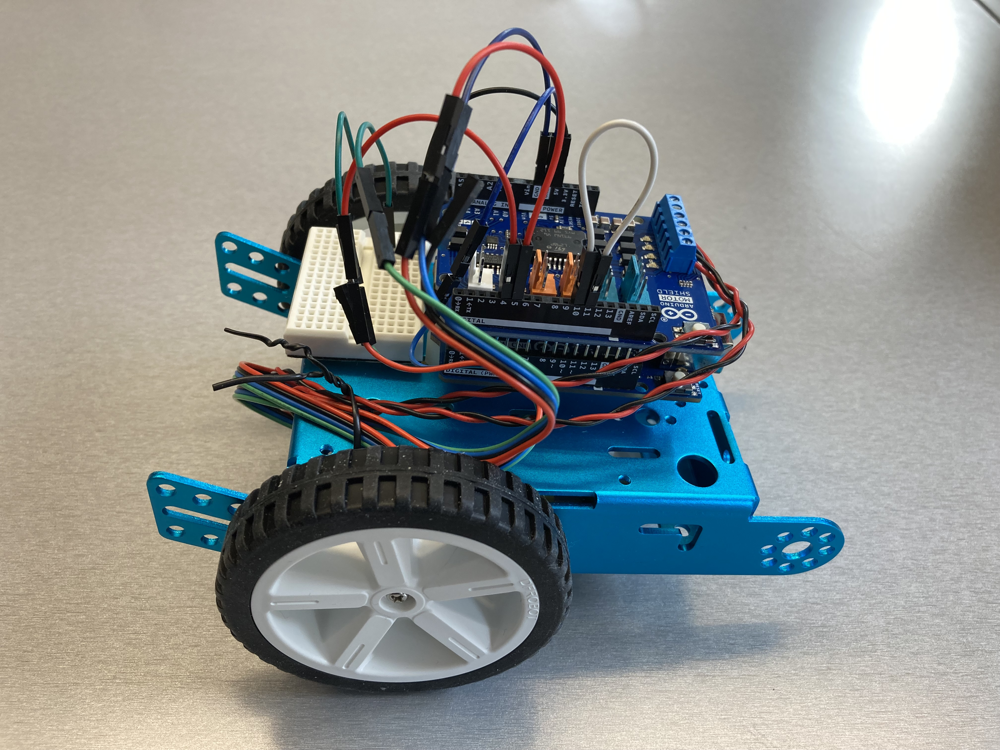
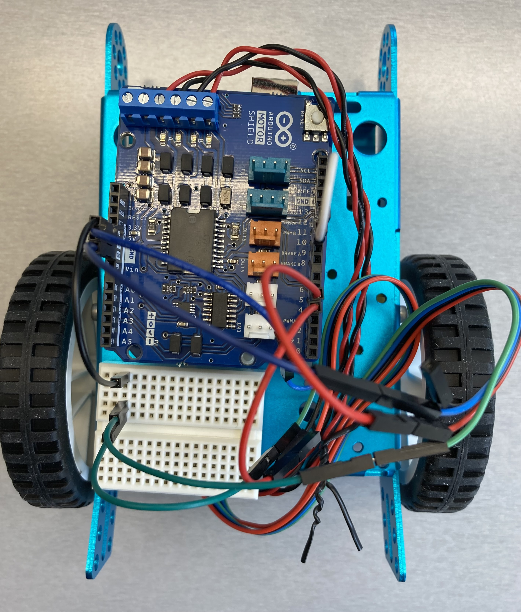
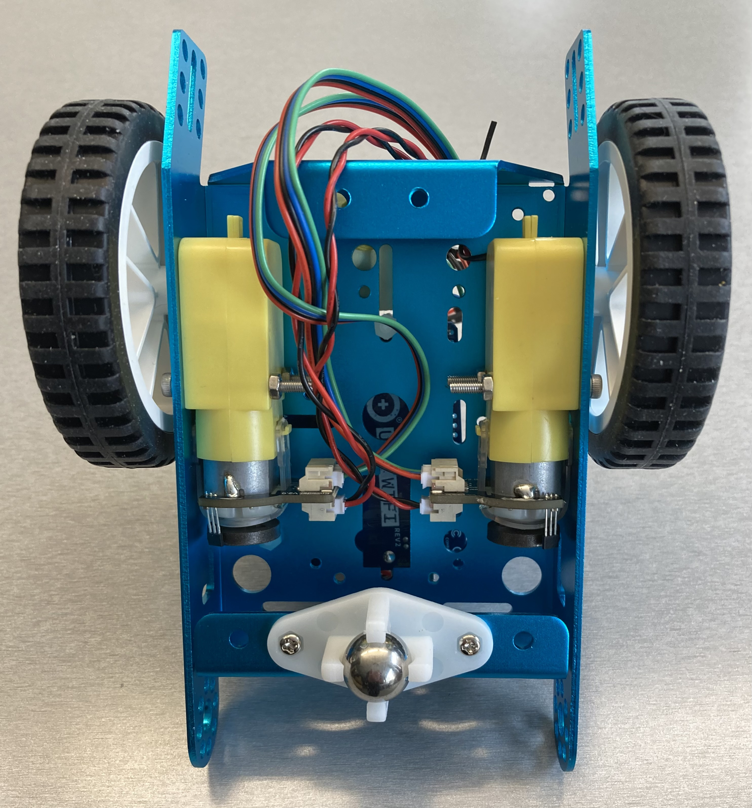

# Arduino UNO WiFi Rev2 with Motor Shield Rev3 and DC motors

## Parts

- Purple Aluminum Chassis
  - $14.95 USD at Adafruit <https://www.adafruit.com/product/3796>
- Arduino UNO WiFi Rev2
  - $53.80 USD at the Arduino store <https://store-usa.arduino.cc/products/arduino-uno-wifi-rev2>
- Arduino Motor Shield Rev3
  - $27.60 USD at the Arduino store <https://store-usa.arduino.cc/collections/shields/products/arduino-motor-shield-rev3>
- 2 x DFRobot FIT0450 motors
  - $10.95 CAD each at RobotShop <https://ca.robotshop.com/products/micro-6v-160rpm-1201-dc-geared-motor-encoder>
  - <https://wiki.dfrobot.com/Micro_DC_Motor_with_Encoder-SJ01_SKU__FIT0450>
- 2 x DFRobot FIT0500 wheels
  - $2.40 CAD each at RobotShop <https://ca.robotshop.com/products/80mm-silicone-wheel-tt-motor>
- 20mm Height Metal Caster Bearing Wheel
  - $1.95 USD at Adafruit <https://www.adafruit.com/product/3948>
- Power source supplying 9V
- M3 nuts and bolts
  - 4 x 30mm, for attaching the motors to the chassis
  - 2 x 20mm, for attaching the metal castor bearing wheels to the chassis
- Standoffs for attaching the Arduino to the chassis, with some separation
  so that the components on the bottom of the Arduino do not touch the metal
  chassis
- Male to male jumper wires
- Mini breadboard, for connecting 2 jumper wires to the single 5V

## Notes

- The wiring seen above in the photos is using "Encoder A phase output" of the
  motor encoders; when running just one of the motors in this configuration,
  I see encoder hits on the other one, the one that isn't running
  - For example, when turning left, and turning right, which each only
    driving one motor, I saw the following:
    - Left (command started)
    - Left done
    - Left: 97 (encoder for left motor)
    - Right: 200 (encoder for right motor)
    - Right (command started)
    - Right done
    - Left: 200 (encoder for left motor)
    - Right: 79 (encoder for right motor)
  - I'm using pins 4 and 5, could they be interfering with each other?
    Seems unlikely. But maybe try 4 and 6?
  - Is it possible that the pins are reversed on the wiki? The colouring of the
    wires doesn't match what I would typically expect for the roles of the
    pins. The red and black wires on the connector are the 2 left most pins,
    looking at the wire socket at the back of the motor with the socket at the
    top. But in the wiki drawing, these are the encoder phase pins.
    Maybe the wiring colouring is right?
