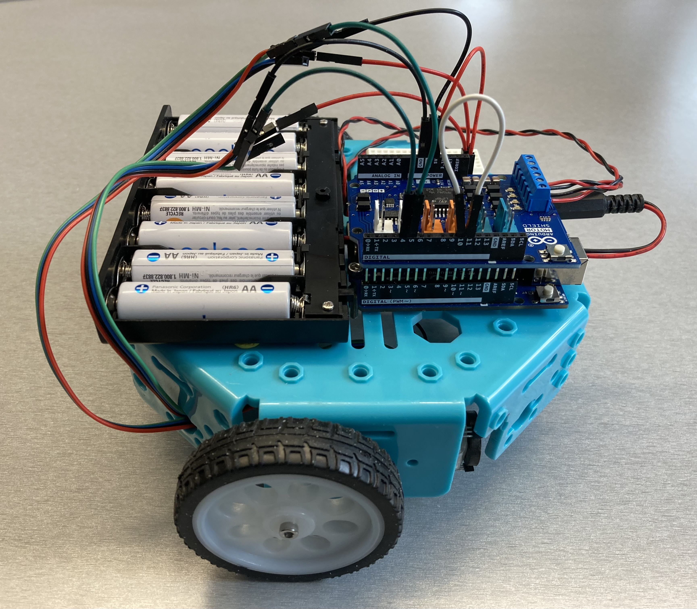
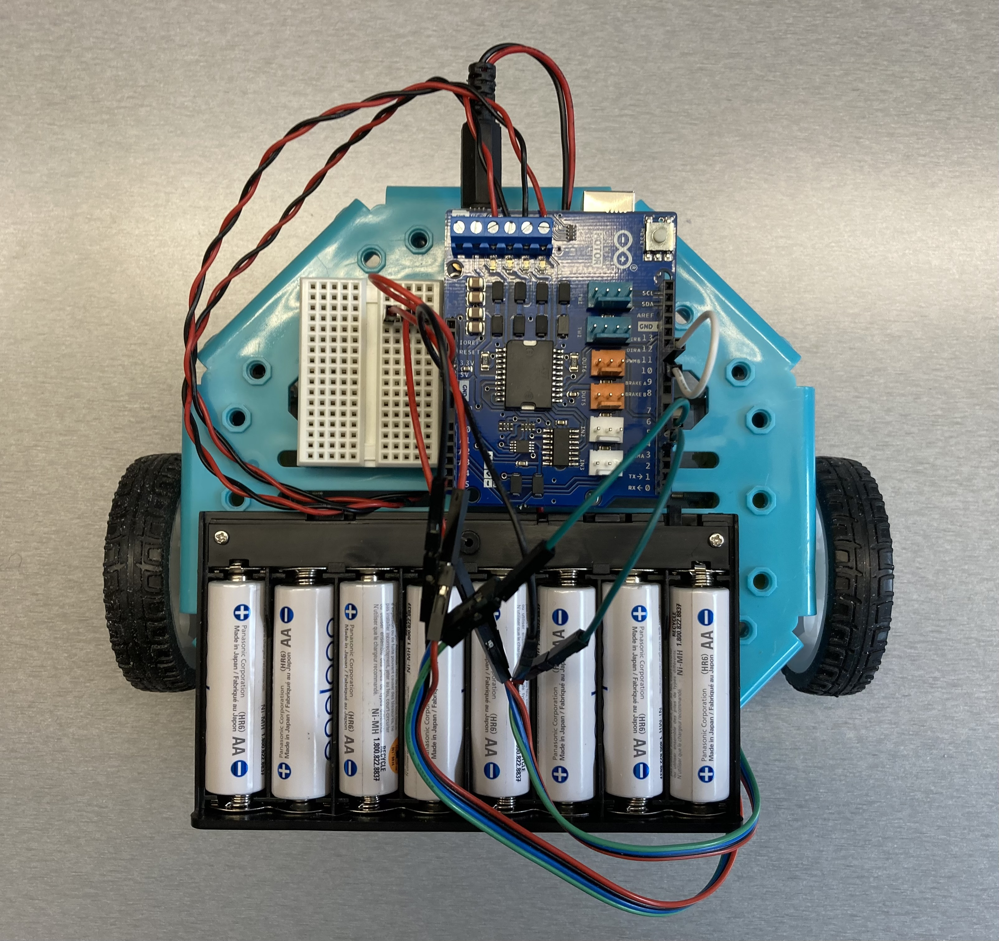
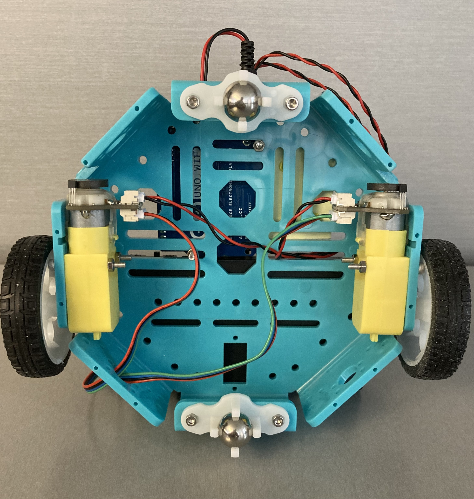

# Arduino UNO WiFi Rev2 with Motor Shield Rev3 and DC motors

## Parts

- Octagon Chassis
  - $9.95 USD at Adafruit <https://www.adafruit.com/product/4466>
- Arduino UNO WiFi Rev2
  - $53.80 USD at the Arduino store <https://store-usa.arduino.cc/products/arduino-uno-wifi-rev2>
- Arduino Motor Shield Rev3
  - $27.60 USD at the Arduino store <https://store-usa.arduino.cc/collections/shields/products/arduino-motor-shield-rev3>
- 2 x DFRobot FIT0450 motors
  - $10.95 CAD each at RobotShop <https://ca.robotshop.com/products/micro-6v-160rpm-1201-dc-geared-motor-encoder>
  - <https://wiki.dfrobot.com/Micro_DC_Motor_with_Encoder-SJ01_SKU__FIT0450>
- 2 wheels for "TT Motor"
  - $1.50 USD each at Adafruit <https://www.adafruit.com/product/3763>
- 2 x 20mm Height Metal Caster Bearing Wheel
  - $1.95 USD each at Adafruit <https://www.adafruit.com/product/3948>
- AA x 8 battery holder with barrel plug
  - $7 at Creatron <https://www.creatroninc.com/product/aa-x-8-cell-battery-enclosure-with-dc-barrel-plug-switch/>
- 8 x AA rechargeable batteries
- M3 nuts and bolts
  - 4 x 30mm, for attaching the motors to the chassis
  - 4 x 20mm, for attaching the metal castor bearing wheels to the chassis
  - 2 x 20mm, for attaching the Arduino board to the chassis
  - 2 x 16mm, for attaching the wheels to the motor axles
- Male to male jumper wires
- Mini breadboard, for connecting 2 jumper wires to the single 5V
- Handi-Tak (or similar) for attaching the battery holder and mini breadboard
  to the chassis

## Notes

- The DFRobot motors don't fit on the octagon chassis as is and part of the
  plastic in front of each motor needed to be cut away from the chassis
  (I used a coping saw)
- The motors mount on the inside of the chassis which means that the length of
  the motor axle is effectively shortened by the thickness of the plastic
  (4 mm) and I needed to shorten the axle mount on the wheel so that it did not
  touch the chassis (I used a coping saw)
- There is a small incompatibility between the Arduino UNO WiFi Rev2 and the
  Motor Shield Rev3: the shield expects PWM on pin D11 but on the Arduino UNO
  WiFi Rev 2, D11 does not support PWM; I used the D10 pin instead on the
  Arduino UNO WiFi Rev2 and wired pins D10 and D11 together (this is why I
  needed the jumper wire connecting pins D10 and D11 that is visible in the
  photos above)

## Additional Programs

- `single_motor`: a program to control a single motor via the serial monitor
  - Send 'on' to turn the motor on and any other message to turn the motor off
  - Does not connect to Weavly
- `two_motors`: a program to control two motors via the serial monitor
  - Send 'left' to turn on the left motor
  - Send 'right' to turn on the right motor
  - Send 'both' to turn on both motors
  - Any other message will turn the motor(s) off
  - Does not connect to Weavly
