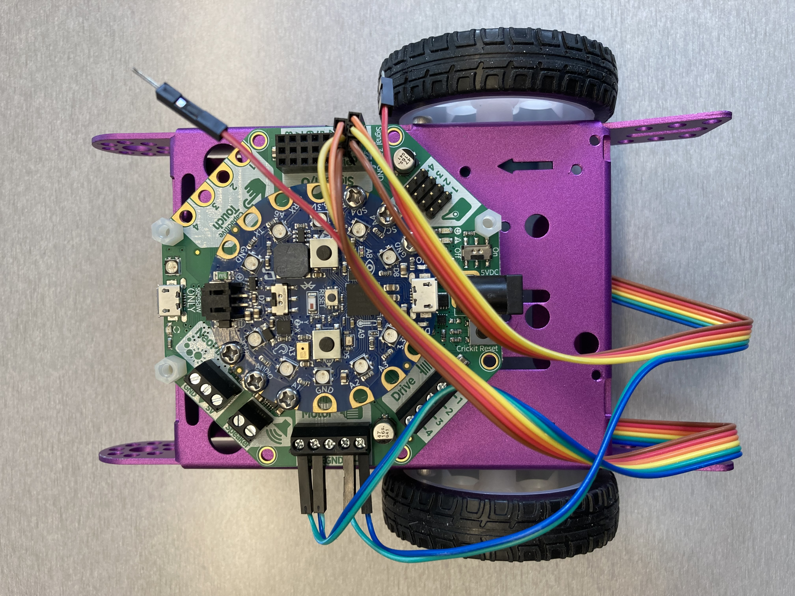
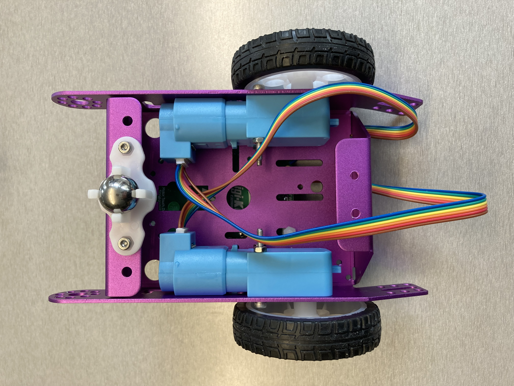

# Adafruit CRICKIT with Circuit Playground Bluefruit and DC motors with encoders

## Parts

- Purple Aluminum Chassis
  - $14.95 USD at Adafruit <https://www.adafruit.com/product/3796>
- Adafruit CRICKIT for Circuit Playground Express
  - $29.95 USD at Adafruit <https://www.adafruit.com/product/3093>
- Circuit Playground Bluefruit
  - $24.95 USD at Adafruit <https://www.adafruit.com/product/4333>
- 2 x Hobby Motor with Encoder
  - $6.50 USD each at Sparkfun <https://www.sparkfun.com/products/16413>
- 2 wheels for "TT Motor"
  - $1.50 USD each at Adafruit <https://www.adafruit.com/product/3763>
- 20mm Height Metal Caster Bearing Wheel
  - $1.95 USD at Adafruit <https://www.adafruit.com/product/3948>
- Power source supplying 4V to 5.5VDC
- M3 nuts and bolts
  - 4 x 30mm, for attaching the motors to the chassis
  - 2 x 10mm, for attaching the metal castor bearing wheel to the chassis
- Standoffs for attaching the CRICKIT to the chassis, with some separation
  so that the components on the bottom of the CRICKIT do not touch the metal
  chassis

## Tools

- Phillips-head screwdriver size PH1, for attaching the Circuit Playground
  Bluefruit to the CRICKIT
- Phillips-head screwdriver size PH00, for the DC motor terminals on the CRICKIT
- Tools to tighten the M3 nuts and bolts

## Wiring

Starting from the right when looking at the jumper wire connector when it is
attached to the motor and the motor is oriented with the connector at the
top, with the colours as seen in the photos above.

Left motor:

- Motor pin 1 (blue) and motor pin 2 (green) to the CRICKIT DC motor 1
  terminals
- Encoder +ve (yellow) to CRICKIT Signal 3.3V
- Encoder A (orange) to CRICKIT Signal 1
- Encoder -v (brown) to CRICKIT Signal GND

Right motor:

- Motor pin 1 (blue) and motor pin 2 (green) to the CRICKIT DC motor 2
  terminals
- Encoder +ve (yellow) to CRICKIT Signal 3.3V
- Encoder A (orange) to CRICKIT Signal 2
- Encoder -v (brown) to CRICKIT Signal GND

## Notes

- The motion still isn't super accurate with this configuration
- It is necessary to poll the encoder inputs but we aren't able to
  poll at a high enough rate to get accurate reading from the encoders
