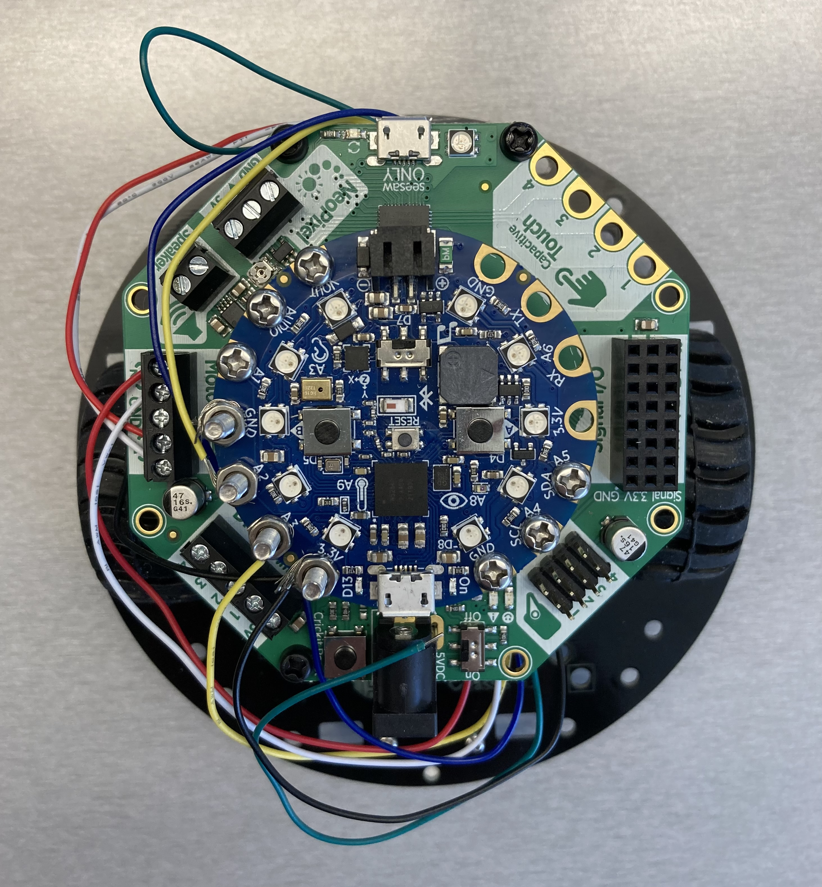
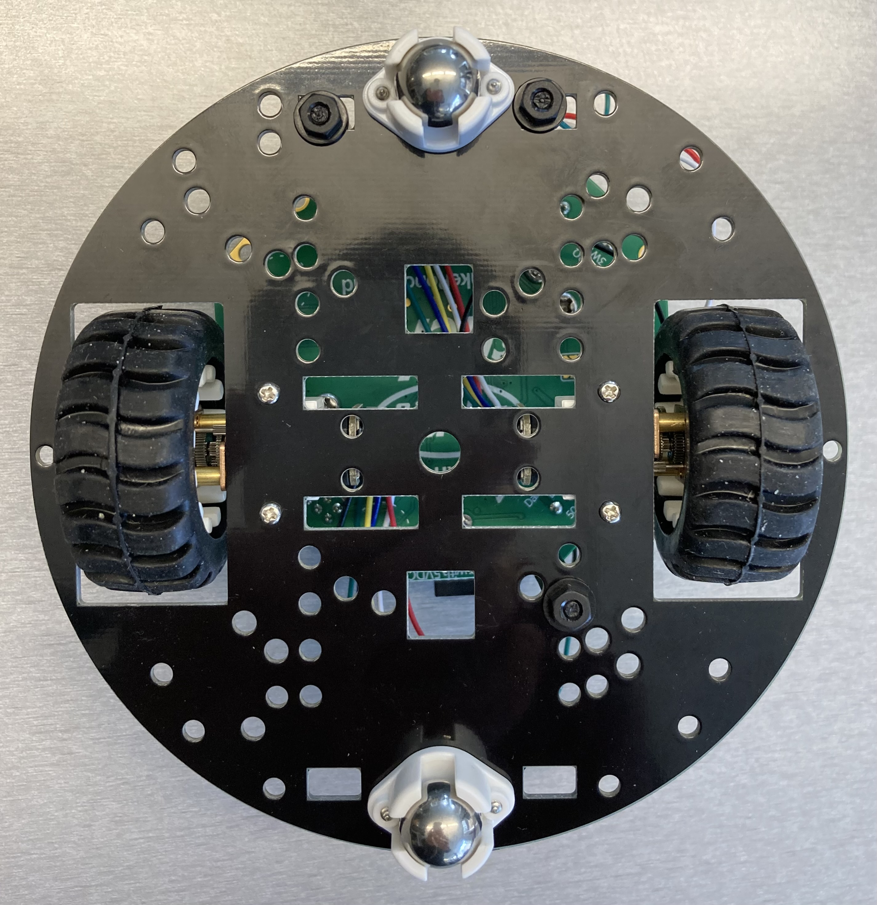
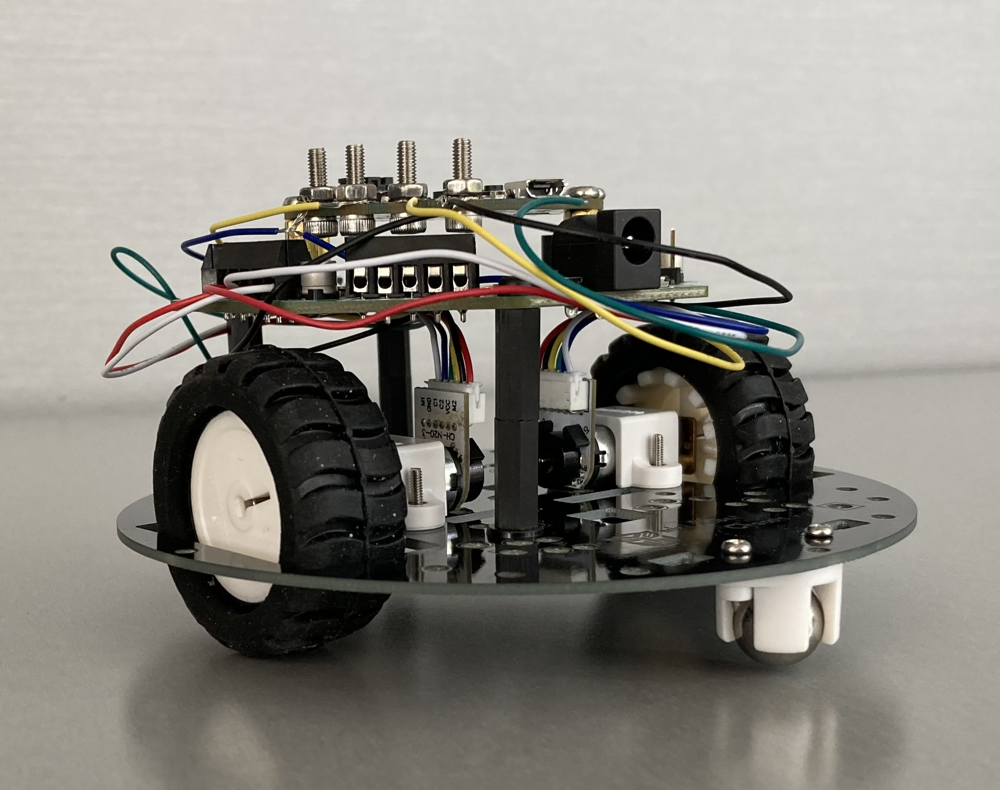

# Adafruit CRICKIT with Circuit Playground Bluefruit and DFRobot miniQ chassis







## Parts

- DFRobot 2WD miniQ chassis ROB0049
  - <https://www.dfrobot.com/product-367.html>
  - $52.17 CAD at RobotShop <https://ca.robotshop.com/products/2wd-miniq-robot-chassis-kit>
- Adafruit CRICKIT for Circuit Playground Express
  - $29.95 USD at Adafruit <https://www.adafruit.com/product/3093>
- Circuit Playground Bluefruit
  - $24.95 USD at Adafruit <https://www.adafruit.com/product/4333>
- 2 x DFRobot Geared motor w/Encoder 6V 41RPM 380:1 FIT0487
  - <https://www.dfrobot.com/product-1437.html>
  - $18.62 CAD each at DigiKey <https://www.digikey.ca/en/products/detail/dfrobot/FIT0487/7087164>
- Power source supplying 4V to 5.5VDC
- Nylon M3 standoffs, for attaching the CRICKIT to the chassis
  - 3 x 30 mm standoffs (I used two 15 mm standoffs connected together to
    make 30 mm, so 6 x 15 mm standoffs will also work)
  - 6 x washers
  - 3 x nuts
  - 3 x screws
- 4 x 10mm M3 bolts and nuts, for attaching the encoder wires to the Circuit Playground

## Tools

- Phillips-head screwdriver size PH1, for attaching the motors and caster
  wheels to the chassis
- Phillips-head screwdriver size PH00, for the DC motor terminals on the
  CRICKIT
- 26 AWG Wire strippers
- Tools to tighten the M3 nuts and bolts

## Wiring

Left motor:

- Motor + (red) and motor - (white) to the CRICKIT DC motor 1
  terminals
- Encoder +ve (black) to Circuit Playground 3.3V
- Encoder A Phase (yellow) to Circuit Playground A2
- Encoder GND (blue) to Circuit Playground GND

Right motor:

- Motor + (red) and motor - (white) to the CRICKIT DC motor 2
  terminals
- Encoder +ve (black) to Circuit Playground 3.3V
- Encoder A Phase (yellow) to Circuit Playground A3
- Encoder GND (blue) to Circuit Playground GND

## Notes

- Connecting the motor encoder wires to the Circuit Playground board was
  difficult. The solution that I ended up using was to strip the wires
  about 1 inch, put M3 bolts through the Circuit Playground pads, wrap the
  stripped wires around the bolts, and then tighten with nuts.
- The code for this robot includes ramping the motor up and down, and
  dynamically adjusting the motor speeds so that they match each other.
  This gives good control over the number of encoder counts per motor for a
  movement and enables syncing of the motors. However, the robot still does
  not move in a straight line. I am able to monitor the encoders on the
  motors to ensure that the motors are running approximately in sync. But,
  I am seeing a difference in the relationship between encoder count and
  wheel movement between the 2 motors. The `single_motor_fixed_encoder_count`
  program runs a single motor for a fixed number of encoder counts. When I
  run the program for each motor for 30,000 encoder counts each, I see the
  following:
  - Wheel on the left motor: 11.3 rotations approx
  - Wheel on the right motor: 10.9 rotations approx
- There isn't a great place for a battery pack
  - It could go on another level, above the controller board, but would
    need another chassis board, like the miniQ upper deck
  - Or we could make a larger custom chassis that would fit a battery pack

## Additional programs

- `single_motor`: turn a single motor on and off using the Serial Monitor;
  this program does not connect to Weavly
- `single_motor_fixed_encoder_count`: run a single motor for a fixed number
  of encoder counts, by sending a message using the Serial Monitor; this
  program does not connect to Weavly

## Running the tests

```text
cd tests
vagrant up
vagrant ssh
mkdir build
cd build
cmake -G Ninja /open_robot_kit/tests
ninja
./tests
```
